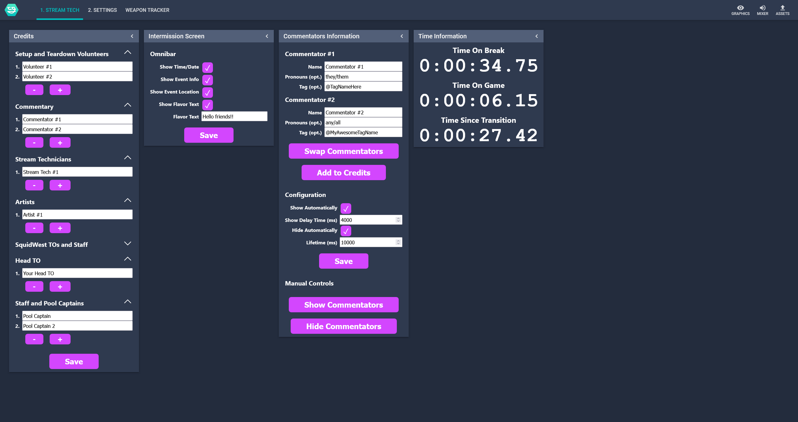
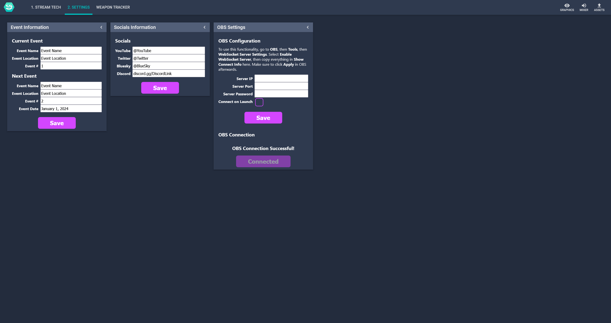

# squidwest-layout-controls

squidwest-layout-controls is a [NodeCG](http://github.com/nodecg/nodecg) bundle for use with [SquidWest](https://bsky.app/profile/squidwest.bsky.social) events.

This bundle contains the associated dashboards and functionality to be used in tandem with a graphics bundle for the associated event.

Events using this repository include:

- **Chi-Shoals**, a Chicago Splatoon LAN: [chishoals-layouts](https://github.com/EpicYoshiMaster/chishoals-layouts)
- **Twin Squiddies**, a Minneapolis Splatoon LAN: [twinsquiddies-layouts](https://github.com/EpicYoshiMaster/twinsquiddies-layouts)

## Images

Images reflect the dashboards as of November 2024, changes or additions may have been made since then!

The Stream Tech tab includes panels for features like a custom credits sequence, a customizable omnibar, commentary lower thirds, and time tracking information.

The Settings tab includes panels for event management including event information, socials, and OBS websocket support.

## Install

1. Complete the steps to obtain [NodeCG](https://www.nodecg.dev/) and [nodecg-cli](https://github.com/nodecg/nodecg-cli).

2. Install the bundle: `nodecg install EpicYoshiMaster/squidwest-layout-controls`.

## Support

If you like the things I make, consider supporting me on my ko-fi page: [https://ko-fi.com/epicyoshimaster](https://ko-fi.com/epicyoshimaster)!
